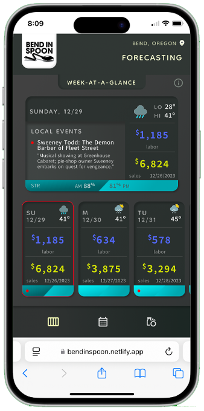
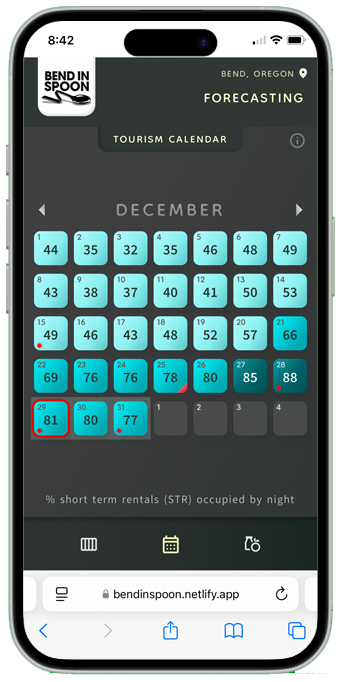
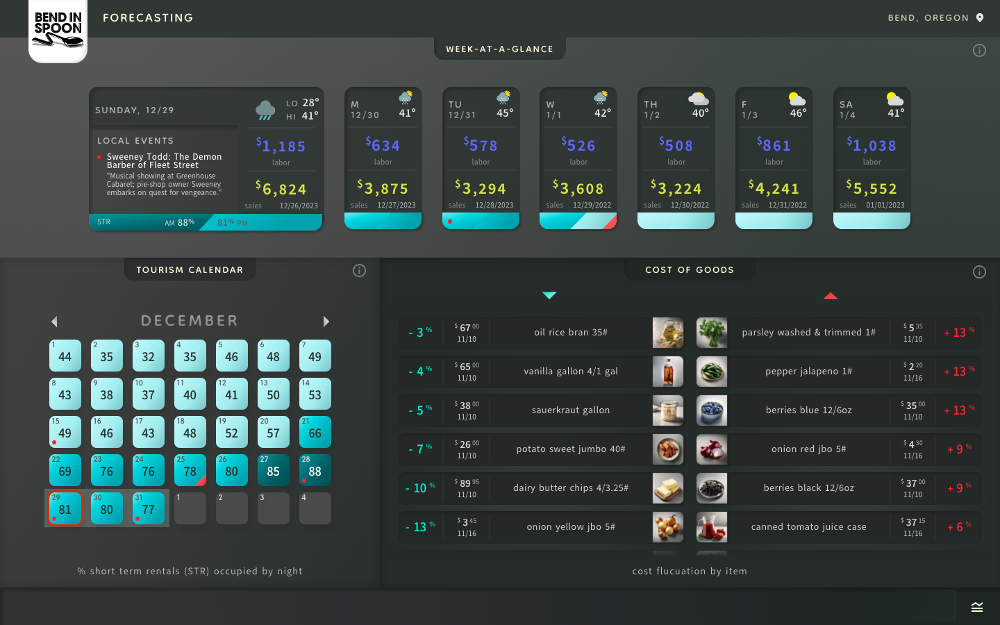

# **📊 Bend In Spoon**  

A dashboard forecasting tool for small restaurants. It tracks occupancy rates for local short-term rentals, cost of goods fluctuations, and provides a weekly breakdown of labor estimates, past sales, weather, events, holidays, and tourism. The app utilizes APIs for short-term rental availability, holidays, weather, and local events. 

## 🚀 **Live Demo**  
🔗 [Deployed Site on Netlify](https://bendinspoon.netlify.app/)  

---

## 📌 **Features**  
✅ Fetches and calculates **daily short term rental occupancy percentages** using data from 2 different **API's** 
✅ Provides weather, holidays, and local events from **three different API's**
✅ Stores and retrieves data using **Firestore**  
✅ Uses **Netlify Serverless Functions** for backend processing  
✅ Built with **Vite** for fast and optimized development  
✅ Fully **responsive** and **mobile-friendly**  
✅ **Deployed on Netlify** with CI/CD  

---

## 🛠️ **Tech Stack**  

### **Frontend**  
- ⚡ Vite
- ⚛️ React.js
- 🎨 CSS

### **Backend & Database**  
- 🔥 Firestore – NoSQL database for data storage  
- 🖥️ Netlify Functions – Serverless backend processing  

### **APIs Used**  
- 📡 **AirDNA: Short Term Rental Analytics, RapidAPI** – Fetches AirBnb property ID by location  
- 📡 **AirBnb-listings, RapidAPI** – Retrieves availability data for each property by ID, fetched from AirDNA API
- 📡 **Weatherbit: Weather API** – Provides daily weather with icons by location
- 📡 **Calendarific: Holiday Calendar API** – Fetches yearly holidays

### **Design Tools**
-  Figma
-  Illustrator
-  Photoshop


---

## Screenshots

### Mobile Views
<p align="center">
  
  
</p>

### Desktop View  
<p align="center">
    
</p>

---

## ⚙️ **Setup & Installation**  

### **1️⃣ Clone this repository**  
```sh
git clone https://github.com/your-username/your-repo.git
cd your-repo
```

### **2️⃣ Install dependencies**  
```sh
npm install
```

### **3️⃣ Set up environment variables**  
Create a `.env` file in the root directory and add the required API keys:  
```sh
VITE_API_KEY_1=your_api_key_here
VITE_API_KEY_2=your_api_key_here
VITE_API_KEY_3=your_api_key_here
VITE_FIREBASE_CONFIG=your_firebase_config_here
```

### **4️⃣ Start development server**  
```sh
npm run dev
```

### **5️⃣ Build for production**  
```sh
npm run build
```

---

## 🚀 **Deployment on Netlify**  

### **Deploying with Netlify Functions**  
1. Ensure your **Netlify functions** are inside the `/netlify/functions` directory.  
2. Add a `netlify.toml` file in the root directory with:  
   ```toml
   [build]
     command = "npm run build"
     functions = "netlify/functions"
   ```  
3. Push to GitHub and connect the repository to **Netlify**.  
4. Netlify will automatically deploy and manage serverless functions.  

---

## 🐞 **Troubleshooting & Debugging**  
- Ensure API keys are correctly set up in `.env` and **not committed** to the repo.  
- If Netlify functions are not working, check logs in the Netlify dashboard.  
- Use **Firestore rules** to secure your database.  

---

## 👨‍💻 **Author**  
👤 Jennifer Holcomb  
📧 Email: jenniferlholcomb@gmail.com  
🖥️ [Portfolio Website](https://jenholcomb.netlify.app) 
🔗 [LinkedIn](https://www.linkedin.com/in/jennifer-holcomb-pdx/)

---

## 📜 **License**  
 
Copyright (c) 2025 Jennifer Holcomb

Permission is hereby granted, free of charge, to any person obtaining a copy of this software and associated documentation files (the "Software"), to deal in the Software without restriction, including without limitation the rights to use, copy, modify, merge, publish, distribute, sublicense, and/or sell copies of the Software, and to permit persons to whom the Software is furnished to do so, subject to the following conditions:

The above copyright notice and this permission notice shall be included in all copies or substantial portions of the Software.

THE SOFTWARE IS PROVIDED "AS IS", WITHOUT WARRANTY OF ANY KIND, EXPRESS OR IMPLIED, INCLUDING BUT NOT LIMITED TO THE WARRANTIES OF MERCHANTABILITY, FITNESS FOR A PARTICULAR PURPOSE AND NONINFRINGEMENT. IN NO EVENT SHALL THE AUTHORS OR COPYRIGHT HOLDERS BE LIABLE FOR ANY CLAIM, DAMAGES OR OTHER LIABILITY, WHETHER IN AN ACTION OF CONTRACT, TORT OR OTHERWISE, ARISING FROM, OUT OF OR IN CONNECTION WITH THE SOFTWARE OR THE USE OR OTHER DEALINGS IN THE SOFTWARE.
